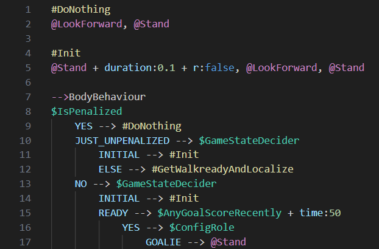

# DSD VSCode Extension

This extension adds language support for the Dynamic Stack Decider ([DSD](https://github.com/bit-bots/dynamic_stack_decider)) language.
As of now, it only adds syntax highlighting but full language support including auto-completion, auto-formatting and more is planned.

## Features

- Syntax highlighting for DSD files:

  
[Code Source](https://github.com/bit-bots/bitbots_behavior/blob/master/bitbots_body_behavior/bitbots_body_behavior/minimal.dsd)

- Basic VS Code language features: currently only toggle comment (\[Ctrl + /\] by default).

## Requirements

As of now this extension has no requirements. This will change once further features are added so check back here when you update the extension.

## Extension Settings

As of now this extension has no settings. Mandetory settings will be added once further features are added so check back here when you update the extension.

<!-- This extension contributes the following settings:

* `myExtension.enable`: Enable/disable this extension.
* `myExtension.thing`: Set to `blah` to do something. -->

## Known Issues

- The name of the entrypoint is currently not highlighted.

If you find any issues not listed here, please report them on the [GitHub issue tracker](https://github.com/Mastermori/vscode-dsd/issues).

## Release Notes

A comprehensive changelog can be found in this [changelog](./CHANGELOG.md).

### 0.0.1

Initial development release, providing syntax highlighting for DSD files.

<!-- ### 1.0.0

Initial release. -->
